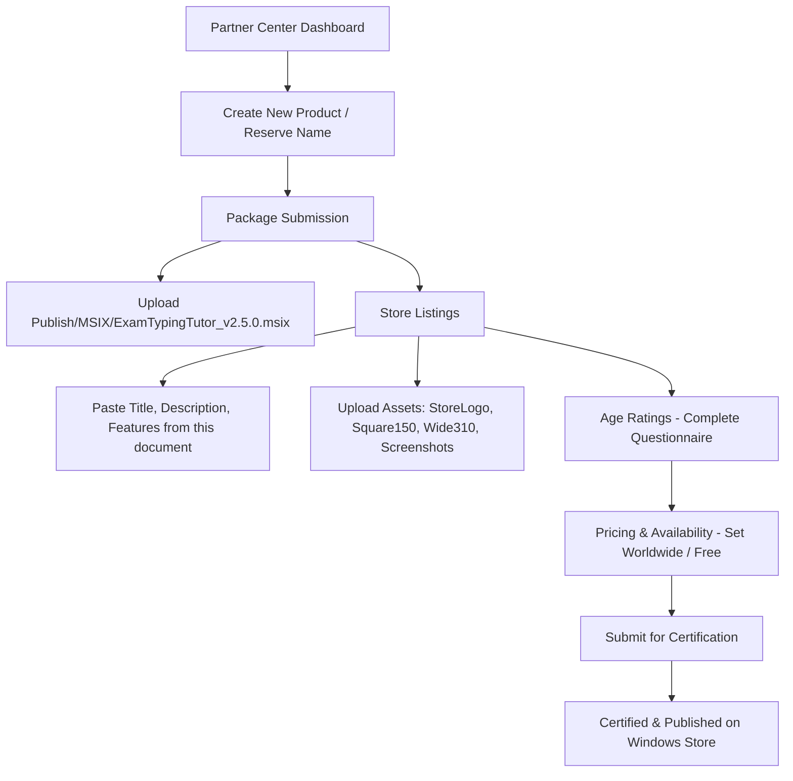

# Microsoft Store Listing - ExamTyping Tutor

This document contains the complete, ready-to-copy metadata and text for submitting **ExamTyping Tutor** to the **Microsoft Partner Center**.

---

## 1. Store Product Title & Basic Details

| Field | Recommended Value |
| :--- | :--- |
| **Product Name** | `ExamTyping Tutor - Official Government Typing Exam Suite` |
| **Short Title / Tile Name** | `ExamTyping Tutor` |
| **Subtitle / Short Description** *(Max 100 chars)* | `Professional Multi-Language Typing Tutor for SSC, Railway, Court, and State Exams.` |
| **Primary Category** | `Education` |
| **Secondary Category** | `Productivity` or `Utilities & tools` |
| **Age Rating** | `Everyone / 3+` (No violence, no user-generated content risk) |
| **Pricing** | `Free` (with optional in-app Pro activation) or your desired tier |

---

## 2. Product Description

### Short Description (Search & Promo Snippet)
> Master touch typing for government competitive examinations and professional work. Features real exam simulations for SSC, Railway RRB, High Court, and State Commissions across English and 10 Indian languages including Hindi (Remington GAIL & Mangal Inscript), Marathi, Punjabi, Gujarati, Bengali, Tamil, Telugu, Kannada, and Malayalam. Includes 1,000+ official passages, speed test analytics, arcade games, and offline candidate tracking.

### Full Store Description (Copy into Partner Center "Description")
```markdown
ExamTyping Tutor is the premier, all-in-one touch typing tutor and exam simulator built specifically for aspirants of competitive government examinations, court typists, stenographers, and professionals.

Whether you are preparing for SSC CGL, CHSL, Railway RRB NTPC, High Court Junior Stenographer, DSSSB, State Public Service Commission (PSC), or typing certification exams (GCC-TBC), ExamTyping Tutor gives you the exact simulation environment, evaluation rules, and keyboard layouts required to clear your exam on the first attempt.

KEY HIGHLIGHTS & MODULES:

1. REAL-TIME EXAM SIMULATION ENGINE
• Exact replica of official exam interfaces used by SSC, Railway, High Court, and State Boards.
• Strict examination timer, live WPM, Net Speed, Gross Speed, and Accuracy metrics.
• Configurable exam constraints: Full-mistake / Half-mistake penalties, Backspace blocking / Full backspace, Word highlighting modes, and passage scrolling behavior.

2. COMPREHENSIVE MULTI-LANGUAGE KEYBOARD SUPPORT
• English: Standard QWERTY Layout.
• Hindi: Remington GAIL (Krutidev layout) and Unicode Mangal Inscript.
• Marathi: Inscript Keyboard & Remington layouts.
• Punjabi: Official Raavi Unicode Inscript.
• Gujarati: Shruti & Inscript Layouts.
• Bengali, Tamil, Telugu, Kannada, and Malayalam fully supported!

3. EXTENSIVE PASSAGE CATALOG (1,000+ PASSAGES)
• 100+ high-yield, 1,000-word passages curated for each supported language.
• Historical speeches, legal judgments, constitution articles, administrative orders, and modern science articles.
• Filter passages by language, difficulty, and word count.

4. STRUCTURED TYPING COURSES & VOCABULARY BUILDER
• Step-by-step interactive typing course from Home Row basics to Number Row and Symbol mastery.
• Visual tactile on-screen keyboard with finger placement guides.
• Language Vocabulary Builder: targeted drills for high-frequency exam terms, complex conjuncts (संयुक्ताक्षर), and technical terminology.

5. ARCADE TYPING GAME (TYPING DEFENDER)
• Fun, fast-paced space defender arcade game to build reflex typing speed and finger dexterity.
• Native support for falling words in English, Hindi, Marathi, and all regional languages.

6. CANDIDATE PROFILES & ADVANCED OFFLINE ANALYTICS
• Multi-user profile management: Register, Login, or use Guest Mode (Skip).
• Complete history tracking per candidate with detailed score breakdown and error logs.
• 100% offline functionality: Zero tracking, no keystroke uploading, and complete data privacy.

Give yourself the winning edge in your competitive typing exam with ExamTyping Tutor!
```

---

## 3. Product Features (List up to 20 Features)
1. Real examination simulator matching SSC, Railway, Court, and State PSC test software.
2. Complete Indian language support: Hindi (Remington GAIL & Inscript), Marathi, Punjabi, Gujarati, Bengali, Tamil, Telugu, Kannada, Malayalam, and English.
3. 1,000+ long exam passages (100+ passages with up to 1,000 words per language).
4. Full mistake and half mistake scoring according to official government commission formulas.
5. Interactive tactile on-screen keyboard with dynamic finger guidance.
6. Typing Defender arcade speed game with multi-language word falling physics.
7. Candidate login, user history isolation, and comprehensive offline performance analytics.
8. Configurable examination rules (Backspace lock, word highlight on/off, custom test duration from 1 to 30 minutes).
9. Works 100% offline with zero external dependencies and complete data privacy.

---

## 4. Search Keywords / Tags (Up to 7 Search Terms)
1. `typing tutor`
2. `ssc typing test`
3. `mangal inscript`
4. `hindi remington typing`
5. `court typing exam`
6. `marathi typing`
7. `touch typing speed test`

---

## 5. Applicable License Terms (EULA)
Refer to [LICENSE_TERMS.md](file:///e:/PlayGround/TypingTutor/Store/LICENSE_TERMS.md) for full text.

---

## 6. System Requirements
- **OS:** Windows 10 (version 1809 / build 17763 or higher) or Windows 11
- **Architecture:** x64
- **Memory:** Minimum 2 GB RAM (4 GB recommended)
- **DirectX:** Version 9 or higher
- **Input:** Standard physical keyboard

---

## 6. Microsoft Partner Center Upload Checklist



### Steps to Submit:
1. **Log in:** Go to [Microsoft Partner Center](https://partner.microsoft.com/dashboard/apps/overview).
2. **Reserve Name:** Click **"New product" > "MSIX or PWA app"** and enter `ExamTyping Tutor`.
3. **Packages:**
   - In the "Packages" section, drag and drop `Publish\MSIX\ExamTypingTutor_v2.5.0.msix`.
   - Partner Center will automatically parse `AppxManifest.xml` and validate `runFullTrust` capability.
4. **Store Listings:**
   - Copy and paste the description, features, and keywords from Sections 1–4 above.
   - Upload screenshots captured from the app.
   - Set the Privacy Policy URL (point to your hosted privacy policy or GitHub repository link: e.g., `https://raw.githubusercontent.com/.../Store/PRIVACY_POLICY.md`).
5. **Age Ratings:**
   - Answer the IARC questionnaire (Educational application, no user chat, no adult themes -> rating will be `Everyone / 3+`).
6. **Publish:**
   - Click **"Submit to the Store"**. Microsoft's automated certification will review the package (typically takes 6 to 24 hours).
